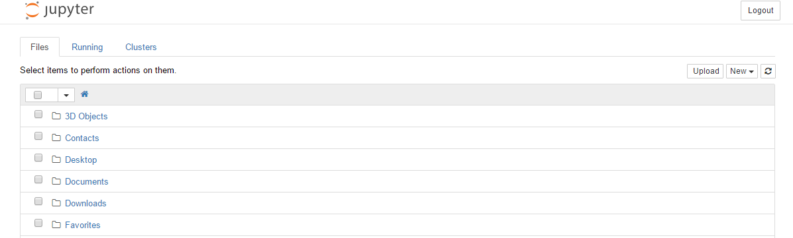
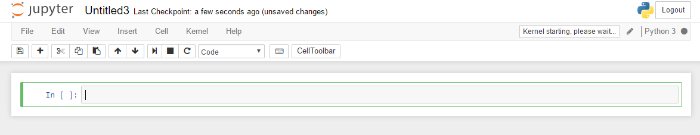

# Chapter 1 Installation and Setup

### Python Setup

Install python by visiting https://www.python.org/downloads/.
The python website auto detects the OS of your machine and provide you with the relevant setup. The setup for windows is an exe installer.
Once you have completed the python installation, check if python environment variable is properly setup by running command prompt in windows and typing

```
>python 
Python 3.6.0 (v3.6.0:41df79263a11, Dec 23 2016, 07:18:10) [MSC v.1900 32 bit (Intel)] on win32
Type "help", "copyright", "credits" or "license" for more information.
>>>
```

The result should be similar to above detailng about python version in my case it is 3.6.0.

#### Pip 

Pip is a package manager for python which work as downloader and installer of python packages from online repository.
To ensure pip is successfully running on your machine run following command

```
>pip3
pip3

Usage:
  pip <command> [options]

Commands:
  install                     Install packages.
  download                    Download packages.
  uninstall                   Uninstall packages.
  freeze                      Output installed packages in requirements format.
  list                        List installed packages.
  show                        Show information about installed packages.
  check                       Verify installed packages have compatible dependencies.
  search                      Search PyPI for packages.
  wheel                       Build wheels from your requirements.
  hash                        Compute hashes of package archives.
  completion                  A helper command used for command completion.
  help                        Show help for commands.
```

This output describes that pip is successfully running on your machine.


#### Installing Pandas and Numpy

We will use pip package manager to download pandas and numpy library.

Run command prompt and execute command to update pip to latest version

```
pip3 install --upgrade pip
```

Then install numpy library using

```
pip3 install numpy
```

Numpy download will install and later after download installtion will auto begin.

After numpy install pandas **Numpy is prerequisite for pandas so be sure to install numpy first**

```
pip3 install pandas
```

#### Installing Jupyter Notebook

Now we have downloaded the required library, configured our python and all set and ready. Its time to get our canvas to work around. There are various alternative of python editor we will use Jupyter one of the most famous web based notebook for various languages.

To install jupyter use the following command

```
pip3 install jupyter
```

Once the jupyter is intalled use following command from your command prompt to run jupyter notebook.

```
jupyter notebook
```

The interface for jupyter looks like in image below



Jupyter can be used with various programming languages, each of which is configured using kernels. As jupyter server is build on python and it is available by default. For more on kernels visit [kernels page](http://jupyter.readthedocs.io/en/latest/projects/kernels.html).

To run new python notebook go to new button and click python 3 option. Which will open window for running your python code. The interface will look like the image shown below.




With this we come to the end of configuring our python environment. More examples on python will be available in next chapter.
